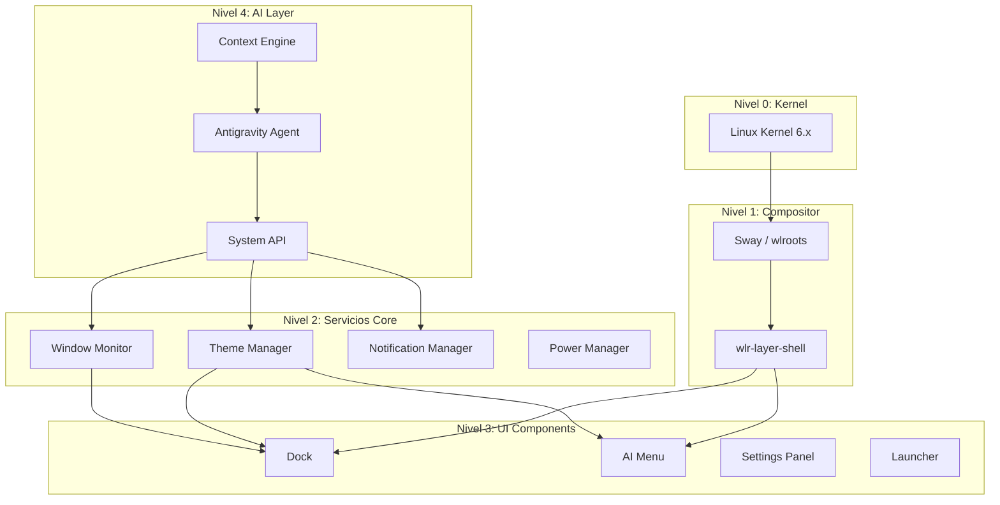

# MiDistroIA: Manifiesto de Arquitectura

> *"No personalizamos Ubuntu. Construimos algo nuevo."*

---

## 1. Visión

**MiDistroIA** es un sistema operativo diseñado desde cero para la era de la Inteligencia Artificial.

- **Para humanos**: Interfaz minimalista, elegante, sin fricción.
- **Para IAs**: APIs abiertas, componentes modulares, estado legible y modificable.
- **Filosofía**: Cada línea de código tiene propósito. Lo que no suma, resta.

---

## 2. Principios de Diseño

| Principio | Descripción |
|-----------|-------------|
| **IA-First** | Cada componente debe ser legible y modificable por una IA. |
| **Minimalismo extremo** | Solo lo esencial. Sin bloatware, sin daemons innecesarios. |
| **Glassmorphism** | Estética consistente: transparencias, blur, bordes suaves, paleta oscura. |
| **Modularidad** | Cada pieza del sistema es reemplazable sin afectar otras. |
| **Documentación como código** | La arquitectura se documenta junto al código, siempre actualizada. |

---

## 3. Capas del Sistema



---

## 4. Stack Tecnológico

| Capa | Tecnología | Justificación |
|------|------------|---------------|
| Kernel | Linux 6.x | Estable, bien soportado, base de todo |
| Compositor | **Hyprland** | Wayland nativo, Layer Shell, blur/glassmorphism nativo, animaciones |
| UI Toolkit | GTK4 + Python | Rápido desarrollo, buena integración con Wayland |
| Theming | CSS + JSON | Fácil de modificar por IA y humanos |
| IPC | Unix Sockets + JSON | Simple, universal, debuggeable |
| AI Runtime | Python + Local LLM | Procesamiento local cuando sea posible |

---

## 5. Migración de GNOME a Sway

### ¿Por qué Sway?

| GNOME | Sway |
|-------|------|
| Pesado (~800MB RAM) | Ligero (~50MB RAM) |
| Extensions frágiles | Configuración por fichero |
| Layer Shell mal soportado | Layer Shell nativo |
| Difícil de automatizar | 100% scriptable |
| Diseño para usuarios casuales | Diseño para power users/devs |

### Plan de Migración

1. **Instalar Sway y dependencias**
   ```bash
   sudo apt install sway swaylock swayidle waybar wl-clipboard
   ```

2. **Crear configuración base**
   - `~/.config/sway/config` - configuración principal
   - `~/.config/waybar/` - barra alternativa (opcional, pero útil para transición)

3. **Adaptar el Dock**
   - Con Sway, `Gtk4LayerShell` funciona perfectamente
   - El dock se anclará al fondo sin hacks

4. **Integrar lanzador de sesión**
   - Añadir entrada en `/usr/share/wayland-sessions/` para MiDistroIA

5. **Primer arranque**
   - Cerrar sesión GNOME
   - Seleccionar "MiDistroIA" en GDM
   - Sway arranca, dock se posiciona, sistema listo

---

## 6. Estructura de Directorios

```
~/Dev/MiDistroIA/
├── config/
│   ├── theme.json          # Paleta, fuentes, espaciados
│   ├── sway/               # Configuración de Sway
│   │   └── config
│   └── ai/                 # Configuración del agente IA
│       └── permissions.json
├── core/
│   ├── theme_manager.py    # Motor de temas
│   ├── window_monitor.py   # Monitor de ventanas (reemplaza monitor.py)
│   └── system_api.py       # API para que la IA interactúe
├── ui/
│   ├── dock/
│   │   ├── main_dock.py
│   │   └── style.css
│   ├── menu/
│   │   ├── ai_menu.py
│   │   └── style.css
│   └── launcher/           # Futuro lanzador de apps
├── scripts/
│   ├── install.sh          # Instalador del sistema
│   ├── start_session.sh    # Arranca la sesión MiDistroIA
│   └── switch_dock.sh      # (Legacy, será deprecado)
└── docs/
    ├── ARCHITECTURE.md     # Este documento
    └── AI_INTEGRATION.md   # Cómo la IA interactúa con el sistema
```

---

## 7. Roadmap

### Fase 1: Fundación (Actual)
- [x] Estructura de carpetas
- [x] Motor de temas básico
- [x] Dock funcional con apps abiertas
- [ ] **Migrar a Sway**
- [ ] Dock fijo y centrado (layer shell)
- [ ] Clicks en dock activan ventanas

### Fase 2: Core Services
- [ ] Window Monitor como servicio independiente
- [ ] Notification Manager
- [ ] Power Manager
- [ ] System API v1

### Fase 3: AI Integration
- [ ] Context Engine (lee estado del sistema)
- [ ] Permissions system (qué puede modificar la IA)
- [ ] Auto-optimization daemon
- [ ] Voice/text command interface

### Fase 4: Polish
- [ ] Animaciones fluidas
- [ ] Gestos táctiles
- [ ] Multi-monitor
- [ ] Instalador ISO

---

## 8. Métricas de Éxito

| Métrica | Objetivo |
|---------|----------|
| RAM en idle | < 200MB |
| Tiempo de arranque | < 3s a dock visible |
| Componentes Ubuntu | 0 (solo kernel) |
| Archivos de config | 100% legibles por IA |
| Cobertura de documentación | 100% |

---

## 9. Próximo Paso

**Instalar Sway y probar el dock con Layer Shell real.**

Una vez confirmado que funciona, podemos empezar a reemplazar componentes de GNOME uno a uno hasta que el sistema arranque directamente en nuestra experiencia, sin rastro del escritorio original.

---

*Documento vivo. Actualizado por Antigravity.*
