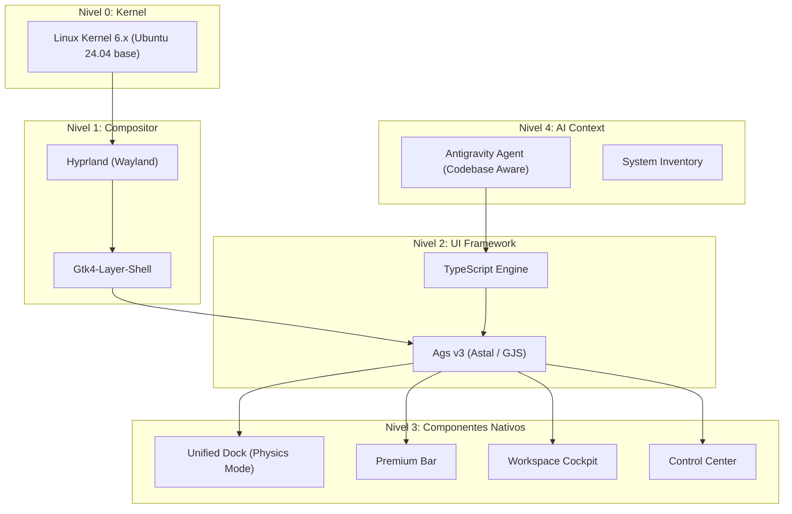

# Crystal Shell: Manifiesto de Arquitectura 🛡️🚀💎

> *"No personalizamos Ubuntu. Construimos algo nuevo."*

---

## 1. Visión

**Crystal Shell** es un sistema operativo diseñado desde cero para la era de la Inteligencia Artificial.

- **Para humanos**: Interfaz minimalista, elegante, sin fricción (Glassmorphism).
- **Para IAs**: APIs abiertas, componentes modulares, estado legible y modificable.
- **Filosofía**: Cada línea de código tiene propósito. Lo que no suma, resta.

---

## 2. Principios de Diseño

| Principio | Descripción |
|-----------|-------------|
| **IA-First** | Cada componente debe ser legible y modificable por una IA. |
| **Minimalismo extremo** | Solo lo esencial. Sin bloatware, sin daemons innecesarios. |
| **Glassmorphism** | Estética consistente: transparencias, blur, bordes suaves, paleta oscura. |
| **Modularidad** | Cada pieza del sistema es reemplazable sin afectar otras. |
| **TypeScript Type-Safety** | Código robusto y auto-documentado mediante tipos estrictos. |

---

## 3. Capas del Sistema



---

## 4. Stack Tecnológico

| Capa | Tecnología | Justificación |
|------|------------|---------------|
| Kernel | Linux 6.x | Estable, base Ubuntu 24.04 LTS |
| Compositor | **Hyprland** | Blur dinámico, animaciones Bezier, gestión de ventanas moderna |
| UI Framework | **Ags v3 (Astal)** | Basado en GJS, permite usar TypeScript y GTK4 con LayerShell nativo |
| Estilos | **Vanilla CSS** | Máximo control sobre el Glassmorphism y filtros de backdrop |
| Procesos | **GJS / GLib** | Integración profunda con el sistema Linux y DBus |

---

## 5. Estructura de Directorios (Ags v3)

```text
~/.config/crystal-shell/
├── config/
│   ├── hypr/               # Configuración estricta de Hyprland
│   └── theme.json          # (Futuro) Tokens de diseño unificados
├── ui/
│   └── ags-v3/             # Nueva Arquitectura Nativa
│       ├── app.ts          # Punto de entrada
│       ├── style.css       # Definición del Glassmorphism
│       ├── widget/         # Componentes Core
│       │   ├── Dock.tsx    # Dock con Magnificación Gaussiana (Motor Físico)
│       │   ├── DockItem.tsx # Componente de Ítem Individual
│       │   ├── DockUtils.ts # Utilidades Gráficas (Cairo)
│       │   ├── Bar.tsx     # TopBar con integración de servicios
│       │   └── WorkspaceOverview.tsx # Cockpit de Geometría Absoluta
│       └── core/           # Lógica de negocio (IconMapper, AppService)
├── scripts/
│   ├── reload_ui.sh        # Recarga caliente de la interfaz
│   └── start_wayland_stack.sh # Orquestador de arranque
└── docs/                   # Documentación viva
```

---

## 6. Roadmap (Estado Actual)

### Fase 1: Fundación UI (Completado) 💎
- [x] Migración de GNOME a Hyprland puro.
- [x] Implementación de Ags v3 (Astal).
- [x] Dock con Magnificación y Overlap Model.
- [x] TopBar con Glassmorphism premium.

### Fase 2: Cockpit & Inteligencia (En Desarrollo) 🏗️
- [x] **Workspace Cockpit**: Visualización esquemática de ventanas.
- [x] **Geometría Absoluta**: Normalización de coordenadas entre monitores.
- [ ] **Control Center**: Gestión nativa de volumen, brillo y red.
- [ ] **Universal Search**: Integración de búsqueda con el Agente IA.

---

*Documento vivo. Actualizado por Antigravity el 05/02/2026.*
